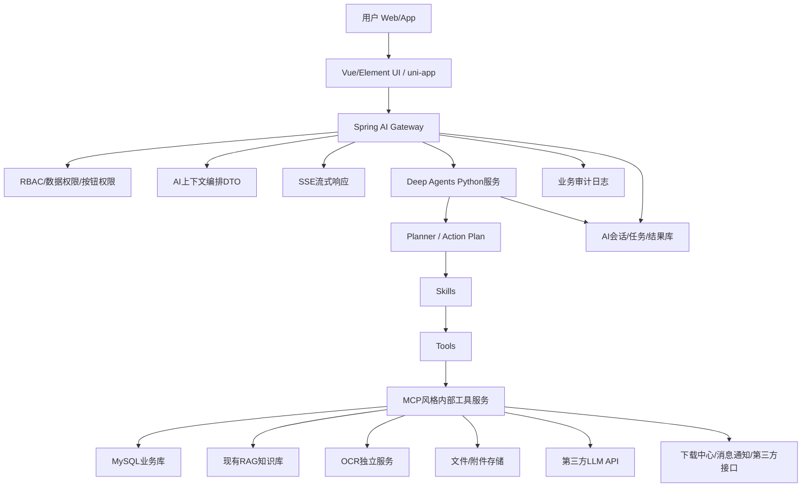
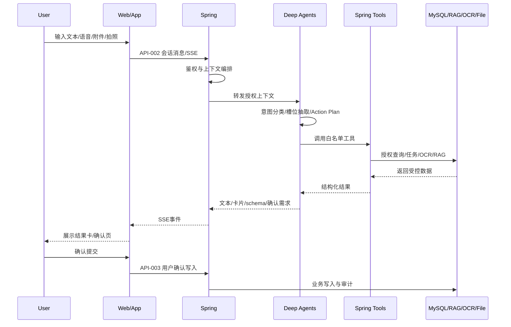
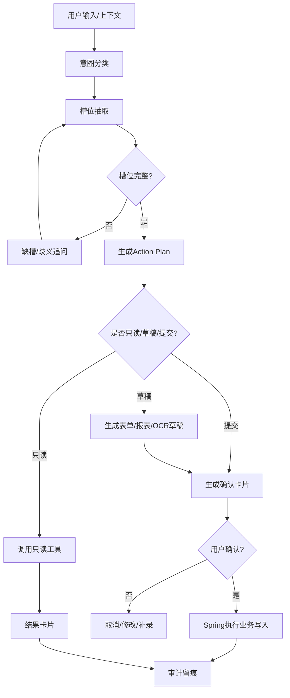
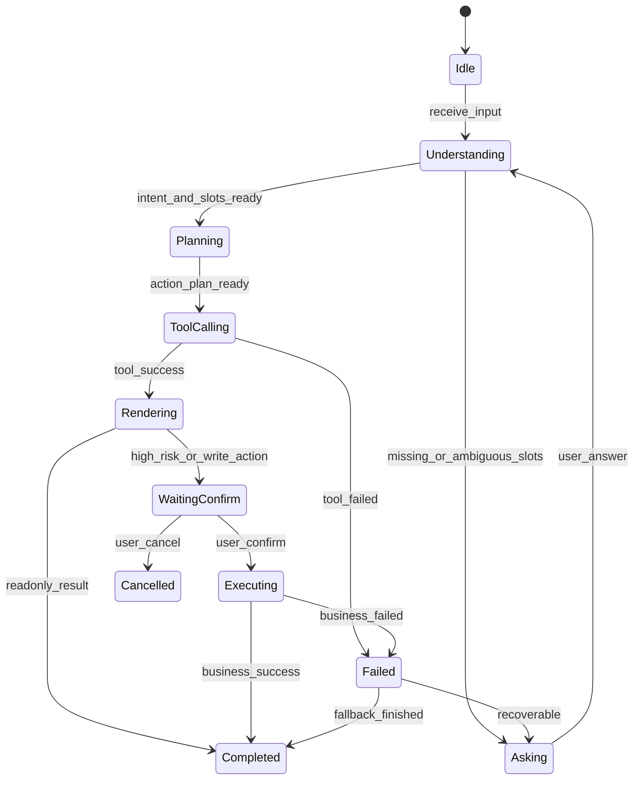
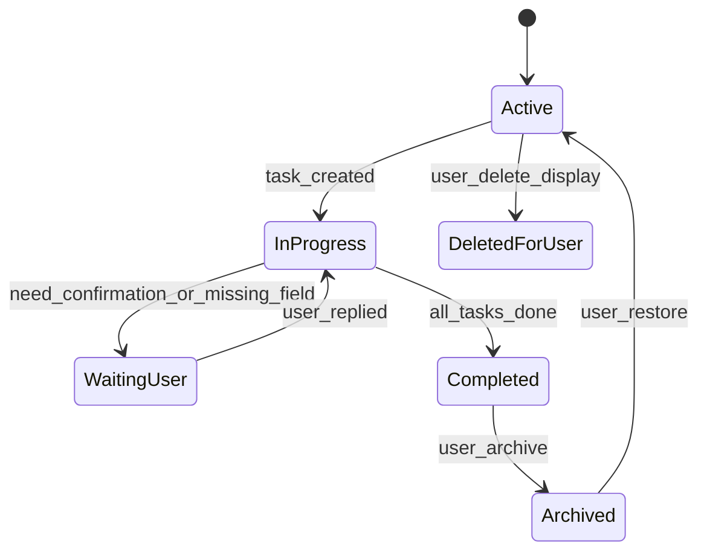
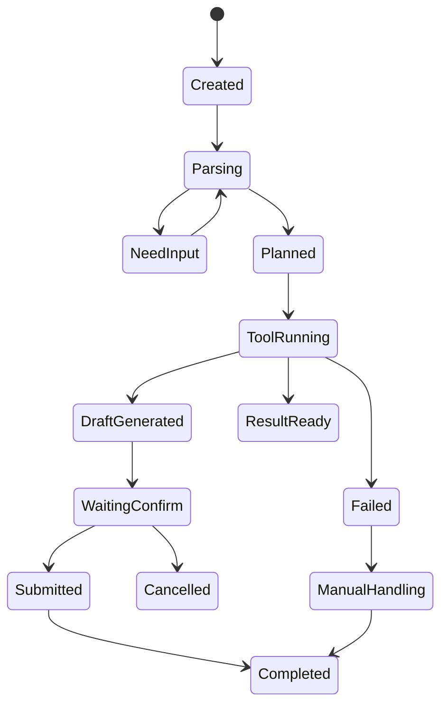
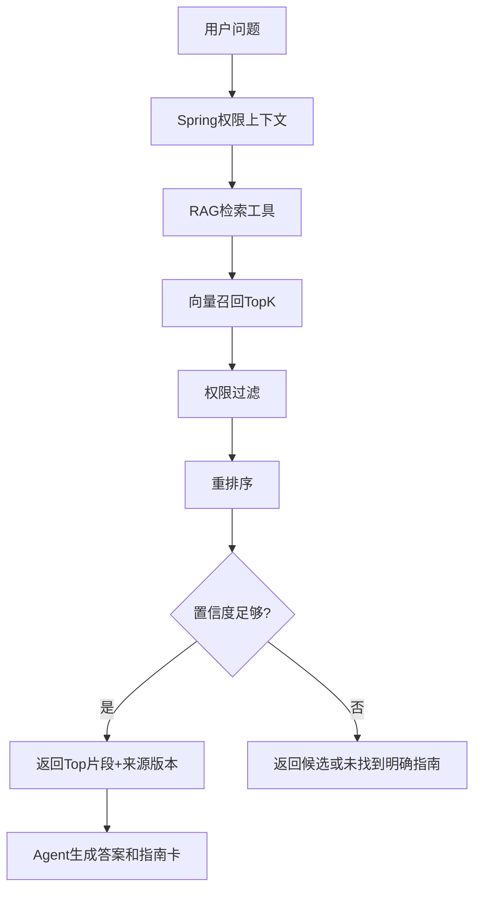
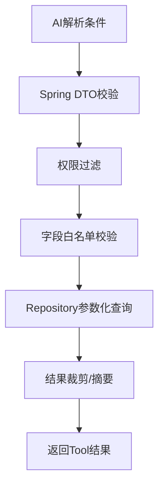

# 工序管控系统 AI 助手（Agent）开发规格说明

版本：V1.0  
日期：2026-07-03  
用途：作为 Codex AI Coding 的唯一开发规格输入  
来源：已收束 Grilling 子线程 01-09 与合并版需求说明书  

## 0. 规格约束

Rule-001：本文档是开发唯一需求来源，编码实现不得引入本文档未列出的业务功能。  
Rule-002：如本文档与旧版需求说明书冲突，以本文档为准。  
Rule-003：所有正式业务写入动作必须经过当前登录用户显式确认。  
Rule-004：AI 生成内容属于建议、草稿、解释或受控 UI schema，不作为业务系统最终事实。  
Rule-005：权限、流程状态、字段校验、审批规则、数据口径以现有 Spring 业务系统规则为准。  
Rule-006：Deep Agents 不直连生产 MySQL，不访问附件原始地址，不执行任意 SQL，不自由调用任意 HTTP。  
Rule-007：Web/App 不直接调用 AI 服务，所有请求统一进入 Spring AI 网关接口。  
Rule-008：一期采用 Deep Agents 独立 Python 编排服务；Dify、商业云 Agent 平台、纯自研通用 Agent 编排层不进入一期生产链路。  
Rule-009：一期采用第三方模型，模型供应商必须满足数据不用于训练、关闭长期留存、分环境密钥、审计、额度控制、异常追踪与可替换要求。  
Rule-010：第三方模型调用必须执行最小必要外发策略；敏感和受限数据不得原文外发。  

---

# 1. 项目概述

## 1.1 项目背景

项目名称为《工序管控系统 AI 助手（Agent）》。现有工序管控系统已经具备 Web 端、App 端、验收/报验管理、检查管理、检查台账、多维报表、附件照片、项目/结构/人员/权限等基础能力。本项目在现有系统上新增统一 AI 助手入口，面向施工单位、监理单位、业主、项目管理人员、集团/直属单位管理人员提供工序资料查询、操作指南检索、报验/检查办理辅助、OCR 填报、数据简报和流程导航能力。

## 1.2 建设目标

Rule-011：系统必须提供 Web 右侧可折叠 AI 侧边栏和 App 底部一级 AI 入口。  
Rule-012：Web/App 必须使用同一套 AI 会话体系、同一任务节点模型、同一历史会话与审计链路。  
Rule-013：AI 必须完成意图识别、槽位抽取、缺失追问、Action Plan、工具调用、结果卡片、确认卡片、审计留痕。  
Rule-014：系统必须提供操作指南查询、候选指南展示、关联业务入口、验收申请草稿、检查记录草稿、提交结果回传。  
Rule-015：系统必须提供四级层级报验/检查数据简报、钻取、导出和历史快照。  
Rule-016：系统必须提供 OCR/视觉识别的半自动闭环：识别提取、候选匹配、人工确认、自动填充、附件挂接、归档追溯。  
Rule-017：系统必须提供受控 GenUI，用于结果卡片、步骤卡、数据简报、追问表单、确认摘要和草稿建议。  

## 1.3 建设范围

一期建设范围：

1. 统一会话容器、任务节点、结果卡片、历史会话。
2. 文本输入、语音转写入口、基础附件/图片上传、App 拍照/相册。
3. 操作指南问答、候选指南、关联表单入口。
4. 自然语言新建验收申请、新建检查记录，进入固定表单页提交。
5. 报验/检查四级统计简报、核心指标、钻取、导出、历史快照。
6. App 白板/责任登记卡照片识别，Web 图片/PDF OCR，确认页，表单自动填充。
7. Deep Agents Python 服务、Spring AI 网关、现有 RAG 工具接入、OCR 服务接入。
8. 受控 GenUI 白名单组件与 UI schema 渲染。
9. 日志审计、配置版本、失败兜底、验收证据包。

## 1.4 不包含范围

Rule-018：一期不建设 Dify 工作流。  
Rule-019：一期不建设知识库内容制作后台。  
Rule-020：一期不实现 AI 代办审批、撤回、整改闭环、复验、删除、批量提交。  
Rule-021：一期不实现无需人工确认的全自动填报。  
Rule-022：一期不实现任意版式 PDF 全文结构化。  
Rule-023：一期不允许 OCR 自动新增项目、结构、人员基础库。  
Rule-024：一期不允许跨项目无权限识别归档。  
Rule-025：一期不开放自定义 SQL、自定义指标公式、权限条件修改、统计口径修改。  
Rule-026：一期不允许 GenUI 输出任意 HTML、JS、Vue 代码或动态脚本。  
Rule-027：一期不建设独立 LLM 网关。  
Rule-028：一期不持久化每个 token 或完整中间推理。  

## 1.5 用户角色

| 角色ID | 角色 | 核心能力 |
|---|---|---|
| Role-001 | 现场作业人员 | 查询指南、发起验收申请、提交检查记录、上传照片/OCR、查看任务状态 |
| Role-002 | 项目管理人员 | 查看项目简报、核对填报结果、追踪流程状态、处理异常 |
| Role-003 | 集团/直属单位管理人员 | 查看四级统计、钻取明细、导出报表、复盘趋势 |
| Role-004 | 项目管理员/监管负责人 | 查看项目范围识别任务、改绑/作废识别批次、处理数据异常 |
| Role-005 | 业务配置管理员 | 维护配置版本、字段模板、匹配规则、GenUI 白名单、发布/回滚 |
| Role-006 | 系统管理员 | 账号、权限、配置发布、接口限流、审计查询 |
| Role-007 | AI/供应商运维 | 模型、OCR、RAG、Deep Agents 故障排查和优化 |

## 1.6 用户故事

US-001：作为现场作业人员，我输入“发起 XX 项目 K10+887 路基验收申请”后，系统生成表单草稿并跳转验收申请单，我确认后提交。  
US-002：作为现场作业人员，我拍摄白板或责任登记卡后，系统识别核心字段、给出候选项目/结构/人员，我确认后自动填入表单。  
US-003：作为项目管理人员，我输入“统计本季度不合格检查记录”，系统返回项目级简报卡并允许钻取明细和导出。  
US-004：作为集团管理人员，我输入“集团 2026 年 2 月工序简报”，系统按权限汇总集团、直属单位、项目、实体工程四级数据。  
US-005：作为管理员，我查看 AI 被修改率、失败率、人工绑定量，并按版本回滚知识库或规则。  

## 1.7 术语说明

| 术语 | 定义 |
|---|---|
| Agent | Deep Agents 编排服务中的业务智能体，负责意图、槽位、工具计划、结果解释 |
| Skill | Agent 可调用的业务技能单元 |
| Tool | Spring 粗粒度业务工具 API 或 AI 服务本地工具封装 |
| MCP | 本规格中的内部工具服务契约层，用于标准化 Tool 与外部资源访问 |
| Action Plan | Agent 调用工具前形成的结构化执行计划 |
| 任务节点 | 会话内一次业务动作的结构化记录 |
| 结果卡片 | 会话中展示任务结果、候选、草稿、确认或错误的结构化 UI 单元 |
| 受控 GenUI | AI 输出受控 UI schema，由白名单组件渲染的辅助交互能力 |
| 识别批次 | 一次 OCR 上传生成的图片/PDF 识别任务集合 |

---

# 2. 总体架构

## 2.1 Mermaid 架构图



## 2.2 模块职责

| 模块 | 职责 |
|---|---|
| Web/App | 采集输入、渲染固定页面、渲染受控 GenUI schema、承接用户确认 |
| Spring AI Gateway | 鉴权、权限过滤、上下文编排、接口适配、工具白名单、写入控制、审计 |
| Deep Agents | 意图分类、槽位抽取、Action Plan、技能路由、结果解释、流式事件 |
| Planner | 根据槽位完整度、置信度、冲突检测生成下一步 |
| Skill | 指南问答、表单办理、统计简报、OCR填报、GenUI组织 |
| Tool | 粗粒度业务动作 API；只读、草稿、提交三类 |
| MCP内部工具服务 | 封装 MySQL、RAG、OCR、文件、模型、消息、审计访问 |
| MySQL业务库 | 现有业务权威数据源和 AI 审计/任务持久化 |
| RAG知识库 | 返回候选知识片段、来源、版本、适用端、置信度 |
| OCR服务 | 返回字段、置信度、OCR文本、来源页/区域、质量判断 |
| LLM | 执行自然语言理解、摘要、解释、受控 schema 生成 |

## 2.3 数据流



## 2.4 控制流

Rule-029：所有请求先进入 Spring，再进入 Deep Agents。  
Rule-030：所有工具调用必须通过 Spring 工具白名单重新鉴权。  
Rule-031：Deep Agents 输出事件必须包含 event_type、conversation_id、task_node_id、trace_id。  
Rule-032：提交类工具必须由前端确认事件触发，不得由 Deep Agents 直接触发。  

---

# 3. Agent 总体设计

## 3.1 Agent职责

1. 总路由 Agent：识别意图并分发到专用 Agent。
2. 指南问答 Agent：操作指南检索、候选指南、表单入口推荐。
3. 表单办理 Agent：验收申请、检查记录草稿、缺失字段追问。
4. 统计简报 Agent：四级统计条件解析、查询计划、简报解释。
5. OCR填报 Agent：触发 OCR、解释结果、追问补录、组织确认。

## 3.2 Agent工作流程



## 3.3 Agent生命周期状态机



## 3.4 会话状态机



## 3.5 任务节点状态机



## 3.6 Prompt组成

| PromptID | 名称 | 内容组成 |
|---|---|---|
| Prompt-001 | System Guard | 身份、边界、禁止自动提交、权限优先、不可泄露不可见数据 |
| Prompt-002 | Router | 意图分类标签、触发样例、输出 JSON schema |
| Prompt-003 | Slot Extractor | 意图槽位定义、默认值来源、缺失字段输出 |
| Prompt-004 | Action Planner | 可用工具、确认规则、幂等键要求、风险等级 |
| Prompt-005 | Guide QA | RAG片段、来源版本、候选指南排序、回答格式 |
| Prompt-006 | Form Draft | 表单字段、来源说明、缺失项、确认卡片文案 |
| Prompt-007 | Report Brief | 统计条件、核心指标、异常规则、钻取入口 |
| Prompt-008 | OCR Explain | OCR字段、置信状态、候选匹配、补录建议 |
| Prompt-009 | GenUI Schema | 白名单组件、字段绑定、动作白名单、降级规则 |

### Prompt-001 System Guard

```text
你是工序管控系统AI助手。你只能基于已授权上下文、RAG片段、OCR结果和Spring工具返回数据回答。
你不得绕过Spring权限，不得生成任意SQL，不得自动提交审批、验收申请、检查记录或覆盖正式记录。
写入类动作必须输出确认需求，由用户在固定确认页或固定业务表单中确认。
当权限不足、数据缺失、口径不一致或置信度低时，必须说明限制并转入候选选择、补录或人工处理。
```

## 3.7 Memory设计

| Memory类型 | 保存内容 | 持久化 |
|---|---|---|
| 会话短期记忆 | 当前输入、最近任务节点、未完成草稿 | Deep Agents运行态 + Spring缓存 |
| 会话历史 | 聊天记录、输入事件、任务节点、卡片结果 | MySQL |
| 业务确认记忆 | 用户确认字段、候选选择、提交结果 | MySQL审计表 |
| RAG引用记忆 | 文档片段ID、版本、适用模块 | MySQL/向量库元数据 |
| OCR确认快照 | AI原值、用户确认值、候选匹配、版本 | MySQL |

Rule-033：历史会话只能用于追溯和提示，不得自动作为新业务动作正式参数。  
Rule-034：用户切换项目/实体工程、关闭会话、跨日期继续或 30 分钟无操作后，业务上下文必须重新确认。  

---

# 4. Skill 设计

| SkillID | Skill名称 | 功能 | 输入 | 输出 | 调用条件 | Prompt | 依赖工具 | 异常 | 并行 | 重试 | 流式 |
|---|---|---|---|---|---|---|---|---|---|---|---|
| Skill-001 | RouterSkill | 意图分类与分发 | 文本、语音转写、上下文 | intent、confidence | 每次用户输入 | Prompt-002 | Tool-001 | Error-001 | 否 | 1 | 是 |
| Skill-002 | SlotFillingSkill | 槽位抽取与追问 | intent、上下文 | slots、missing_fields | intent已识别 | Prompt-003 | Tool-002 | Error-002 | 否 | 2 | 是 |
| Skill-003 | GuideQASkill | 指南检索与候选 | 查询词、上下文 | 指南卡、候选 | 操作指南类意图 | Prompt-005 | Tool-003/004 | Error-003 | 是 | 1 | 是 |
| Skill-004 | FormDraftSkill | 验收/检查草稿 | slots、上下文 | 草稿卡、确认数据 | 表单办理意图 | Prompt-006 | Tool-005/006/007 | Error-005 | 否 | 1 | 是 |
| Skill-005 | ReportBriefSkill | 统计简报 | 层级、时间、类型、筛选 | 指标卡、图表schema | 数据简报意图 | Prompt-007 | Tool-008/009/010 | Error-008 | 是 | 1 | 是 |
| Skill-006 | OCRFillingSkill | OCR填报编排 | 图片/PDF、来源入口 | 识别任务、确认摘要 | OCR上传/识别意图 | Prompt-008 | Tool-011/012/013 | Error-011 | 是 | 1 | 是 |
| Skill-007 | GenUISkill | 受控UI schema生成 | 任务结果、组件约束 | UI schema | 卡片/追问/摘要渲染 | Prompt-009 | Tool-014 | Error-014 | 是 | 0 | 是 |
| Skill-008 | AuditSkill | 审计事件组织 | 事件、trace | 审计记录 | 所有关键节点 | Prompt-004 | Tool-015 | Error-016 | 是 | 2 | 否 |

## 4.1 Skill返回格式

```json
{
  "skill_id": "Skill-004",
  "status": "success|need_input|need_confirm|failed",
  "task_node_id": "TN-xxx",
  "display_message": "string",
  "data": {},
  "missing_fields": [],
  "candidates": [],
  "confirmation": {},
  "errors": []
}
```

---

# 5. Tool 设计

## 5.1 Tool清单

| ToolID | Tool名称 | 描述 | 超时 | 权限 | 日志 |
|---|---|---|---|---|---|
| Tool-001 | classify_intent | 意图分类 | 5s | 登录用户 | 输入摘要、intent、confidence |
| Tool-002 | extract_slots | 槽位抽取 | 5s | 登录用户 | slots、missing_fields |
| Tool-003 | rag_search_guide | 检索操作指南 | 3s | 查看权限 | 查询词、知识库版本、候选 |
| Tool-004 | get_guide_detail | 获取指南详情 | 3s | 指南查看权限 | guide_id、版本 |
| Tool-005 | get_business_context | 获取页面/项目上下文 | 3s | 当前业务权限 | context keys |
| Tool-006 | create_form_draft | 生成验收/检查草稿 | 5s | 新增/编辑权限 | 草稿字段、来源 |
| Tool-007 | confirm_submit_form | 确认提交业务表单 | 10s | 提交按钮权限 | 单号、状态、提交人 |
| Tool-008 | parse_report_condition | 解析统计条件 | 5s | 查看权限 | 条件、缺失项 |
| Tool-009 | query_report_stats | 查询统计指标 | 10s | 数据权限 | 条件、数据范围 |
| Tool-010 | export_report | 发起报表导出 | 30s/异步 | 导出权限 | 导出任务ID |
| Tool-011 | create_ocr_task | 创建OCR识别任务 | 10s | 项目上传权限 | 批次ID、文件ID |
| Tool-012 | get_ocr_result | 获取OCR结果 | 5s | 任务查看权限 | 字段、候选、置信 |
| Tool-013 | confirm_ocr_fill | 确认OCR填表 | 10s | 表单填报权限 | 表单ID、附件挂接 |
| Tool-014 | validate_genui_schema | 校验受控UI schema | 2s | 登录用户 | 校验结果 |
| Tool-015 | write_audit_log | 写审计日志 | 2s | 系统内部 | trace_id、事件 |
| Tool-016 | notify_user | 发送任务/导出通知 | 3s | 系统内部 | 通知ID |

## 5.2 Tool输入输出示例

### Tool-009 query_report_stats

输入：
```json
{
  "trace_id": "TR-20260703-001",
  "user_id": "U1001",
  "level": "project",
  "org_id": "ORG01",
  "project_id": "P001",
  "entity_id": null,
  "date_range": {"from": "2026-07-01", "to": "2026-07-31"},
  "data_types": ["acceptance", "inspection"],
  "status_filters": ["unqualified", "pending_rectify"]
}
```

输出：
```json
{
  "status": "success",
  "data": {
    "total_count": 120,
    "qualified_count": 96,
    "unqualified_count": 12,
    "pending_rectify_count": 8,
    "rectified_count": 4,
    "overdue_unrectified_count": 2,
    "qualified_rate": 0.8,
    "closure_rate": 0.3333
  },
  "trace_id": "TR-20260703-001"
}
```

## 5.3 Tool异常码

| 异常码 | 含义 |
|---|---|
| Error-001 | 意图分类失败 |
| Error-002 | 槽位抽取失败 |
| Error-003 | 指南检索失败 |
| Error-004 | 指南无权限 |
| Error-005 | 表单草稿生成失败 |
| Error-006 | 表单提交权限不足 |
| Error-007 | 表单字段校验失败 |
| Error-008 | 统计条件无效 |
| Error-009 | 报表查询超时 |
| Error-010 | 导出任务创建失败 |
| Error-011 | OCR任务创建失败 |
| Error-012 | OCR结果低置信度 |
| Error-013 | OCR匹配候选冲突 |
| Error-014 | GenUI schema非法 |
| Error-015 | GenUI组件无权限 |
| Error-016 | 审计写入失败 |
| Error-017 | 第三方模型不可用 |
| Error-018 | RAG不可用 |
| Error-019 | Spring工具网关不可用 |

---

# 6. MCP 服务设计

本项目的 MCP 层是内部工具服务契约层。Deep Agents 不直接连接生产数据源，而是通过 Spring 工具网关和 MCP 风格服务调用受控资源。

| MCPID | 服务 | 职责 | 接口 | 数据来源 | 鉴权 | 缓存 | 日志 |
|---|---|---|---|---|---|---|---|
| MCP-001 | business-context-mcp | 上下文DTO聚合 | getContext | MySQL业务表 | Spring RBAC | 30s | trace/context |
| MCP-002 | rag-mcp | 知识检索 | searchGuide/getDoc | RAG向量库 | 文档权限 | 5min | query/version |
| MCP-003 | ocr-mcp | OCR任务 | createTask/getResult | OCR服务/文件 | 项目权限 | 任务缓存 | batch/quality |
| MCP-004 | form-mcp | 表单草稿/提交 | draft/confirm | 业务表单服务 | 按钮权限 | 不缓存提交 | form/audit |
| MCP-005 | report-mcp | 统计简报 | query/export | 报验/检查模块 | 数据权限 | 快照缓存 | conditions |
| MCP-006 | file-mcp | 文件访问 | upload/tempUrl | 附件存储 | 附件权限 | URL TTL | file access |
| MCP-007 | audit-mcp | 审计 | write/query | MySQL审计表 | 管理权限 | 不缓存写入 | full |
| MCP-008 | notification-mcp | 通知 | send/status | 消息中心 | 系统内部 | 无 | notification |

---

# 7. 数据设计

## 7.1 数据库策略

Rule-035：现有业务 MySQL 是业务权威数据源。  
Rule-036：AI 会话、任务、结果、引用来源、检索缓存可进入 AI 独立库或现有 MySQL 独立 schema。  
Rule-037：Spring 审计体系必须保存关键调用摘要、用户、权限、业务对象、写操作痕迹。  

## 7.2 表结构

### ai_conversation

| 字段 | 类型 | 说明 | 索引/约束 |
|---|---|---|---|
| id | varchar(64) | 会话ID | PK |
| user_id | varchar(64) | 用户ID | idx |
| title | varchar(200) | 会话标题 |  |
| status | varchar(32) | active/completed/archived/deleted_for_user | idx |
| last_task_id | varchar(64) | 最近任务节点 | idx |
| created_at | datetime | 创建时间 | idx |
| updated_at | datetime | 更新时间 | idx |
| deleted_at | datetime | 软删除时间 |  |

### ai_task_node

| 字段 | 类型 | 说明 | 索引/约束 |
|---|---|---|---|
| id | varchar(64) | 任务节点ID | PK |
| conversation_id | varchar(64) | 会话ID | FK/idx |
| task_type | varchar(64) | guide/form/report/ocr/export | idx |
| status | varchar(32) | 状态 | idx |
| business_object_type | varchar(64) | 表单/项目/报表类型 | idx |
| business_object_id | varchar(64) | 业务对象ID | idx |
| input_ref_json | json | 引用输入事件 |  |
| result_json | json | 结果卡片数据 |  |
| jump_target_json | json | 跳转目标 |  |
| idempotency_key | varchar(128) | 幂等键 | unique |
| created_at | datetime | 创建时间 | idx |
| updated_at | datetime | 更新时间 | idx |

### ai_input_event

| 字段 | 类型 | 说明 | 索引/约束 |
|---|---|---|---|
| id | varchar(64) | 输入事件ID | PK |
| conversation_id | varchar(64) | 会话ID | idx |
| task_node_id | varchar(64) | 任务节点ID | idx |
| event_type | varchar(32) | text/voice/file/photo/command | idx |
| content_text | text | 文本或语音转写 |  |
| file_id | varchar(64) | 附件ID | idx |
| source_terminal | varchar(16) | web/app | idx |
| created_at | datetime | 创建时间 | idx |

### ai_action_plan

| 字段 | 类型 | 说明 | 索引/约束 |
|---|---|---|---|
| id | varchar(64) | Action Plan ID | PK |
| task_node_id | varchar(64) | 任务节点ID | idx |
| intent | varchar(64) | 意图 | idx |
| slots_json | json | 已提取槽位 |  |
| missing_fields_json | json | 缺失槽位 |  |
| tools_json | json | 拟调用工具 |  |
| need_confirmation | boolean | 是否需确认 | idx |
| risk_level | varchar(16) | low/medium/high | idx |
| created_at | datetime | 创建时间 | idx |

### ai_tool_call_log

| 字段 | 类型 | 说明 | 索引/约束 |
|---|---|---|---|
| id | varchar(64) | 日志ID | PK |
| trace_id | varchar(64) | TraceID | idx |
| task_node_id | varchar(64) | 任务节点 | idx |
| tool_id | varchar(64) | ToolID | idx |
| request_json | json | 请求摘要 |  |
| response_json | json | 响应摘要 |  |
| status | varchar(32) | success/failed/timeout | idx |
| duration_ms | int | 耗时 | idx |
| error_code | varchar(32) | 异常码 | idx |
| created_at | datetime | 创建时间 | idx |

### ai_ocr_batch

| 字段 | 类型 | 说明 | 索引/约束 |
|---|---|---|---|
| id | varchar(64) | 识别批次ID | PK |
| uploader_id | varchar(64) | 上传人 | idx |
| project_id | varchar(64) | 项目 | idx |
| source_type | varchar(32) | whiteboard/card/pdf/image | idx |
| status | varchar(32) | pending/processing/waiting_confirm/confirmed/failed/voided/manual_done | idx |
| original_file_ids | json | 原始文件 |  |
| quality_json | json | 质量检测结果 |  |
| model_version | varchar(64) | 模型版本 | idx |
| template_version | varchar(64) | 字段模板版本 | idx |
| created_at | datetime | 创建时间 | idx |
| updated_at | datetime | 更新时间 | idx |

### ai_ocr_result_group

| 字段 | 类型 | 说明 | 索引/约束 |
|---|---|---|---|
| id | varchar(64) | 结果组ID | PK |
| batch_id | varchar(64) | 批次ID | FK/idx |
| page_no | int | 页码 | idx |
| image_no | int | 图片序号 | idx |
| confirmed_project_id | varchar(64) | 确认项目 | idx |
| confirmed_structure_id | varchar(64) | 确认结构 | idx |
| target_form_id | varchar(64) | 目标表单 | idx |
| status | varchar(32) | 状态 | idx |

### ai_report_snapshot

| 字段 | 类型 | 说明 | 索引/约束 |
|---|---|---|---|
| id | varchar(64) | 快照ID | PK |
| user_id | varchar(64) | 生成用户 | idx |
| query_condition_json | json | 查询条件 |  |
| metrics_json | json | 指标结果 |  |
| chart_config_json | json | 图表配置 |  |
| data_version | varchar(64) | 数据版本 | idx |
| created_at | datetime | 生成时间 | idx |
| expire_at | datetime | 保留到期 | idx |

### ai_genui_schema_log

| 字段 | 类型 | 说明 | 索引/约束 |
|---|---|---|---|
| id | varchar(64) | Schema日志ID | PK |
| task_node_id | varchar(64) | 任务节点 | idx |
| schema_version | varchar(32) | Schema版本 | idx |
| component_type | varchar(64) | 组件类型 | idx |
| schema_json | json | UI schema |  |
| validation_status | varchar(32) | pass/fail | idx |
| created_at | datetime | 创建时间 | idx |

### ai_config_version

| 字段 | 类型 | 说明 | 索引/约束 |
|---|---|---|---|
| id | varchar(64) | 配置版本ID | PK |
| config_type | varchar(64) | guide/rule/prompt/model/genui/ocr | idx |
| version | varchar(64) | 版本号 | unique(config_type,version) |
| content_json | json | 配置内容 |  |
| status | varchar(32) | draft/active/rollback | idx |
| publisher_id | varchar(64) | 发布人 | idx |
| published_at | datetime | 发布时间 | idx |

---

# 8. API 设计

## 8.1 通用Header

```yaml
headers:
  Authorization: Bearer <token>
  X-Tenant-Id: <tenant>
  X-Trace-Id: <trace_id>
  X-Terminal: web|app
```

## 8.2 OpenAPI风格接口清单

### API-001 创建/恢复会话

```yaml
url: /api/ai/v1/conversations
method: POST
permission: login
request:
  page_context: object
  restore_policy: recent_or_page_related
response:
  conversation_id: string
  status: active
  restored: boolean
errors: [Error-019]
```

### API-002 发送消息并接收SSE

```yaml
url: /api/ai/v1/conversations/{conversationId}/messages:stream
method: POST
permission: login
request:
  input_type: text|voice_transcript|command
  content: string
  attachments: array
  page_context: object
response:
  content-type: text/event-stream
  events:
    - text_delta
    - tool_running
    - result_card
    - need_confirmation
    - failed
errors: [Error-001, Error-017, Error-019]
```

### API-003 用户确认写入

```yaml
url: /api/ai/v1/task-nodes/{taskNodeId}/confirm
method: POST
permission: button_permission
request:
  confirmation_id: string
  confirmed_fields: object
  user_changes: object
  idempotency_key: string
response:
  status: submitted|failed
  business_object_id: string
  business_no: string
  current_status: string
errors: [Error-006, Error-007]
```

### API-004 获取上下文

```yaml
url: /api/ai/v1/context
method: POST
permission: current_page_permission
request:
  page_code: string
  object_ids: object
response:
  context_dto: object
errors: [Error-019]
```

### API-005 上传附件/图片

```yaml
url: /api/ai/v1/files
method: POST
permission: upload_permission
request:
  multipart_file: binary
  source_type: attachment|photo|pdf
response:
  file_id: string
  temp_url: string
errors: [Error-011]
```

### API-006 创建OCR任务

```yaml
url: /api/ai/v1/ocr-batches
method: POST
permission: project_upload_permission
request:
  file_ids: array
  source_type: whiteboard|card|pdf|image
  page_selection: all|range|first_n
response:
  batch_id: string
  status: pending
errors: [Error-011]
```

### API-007 获取OCR确认数据

```yaml
url: /api/ai/v1/ocr-batches/{batchId}/confirmation
method: GET
permission: task_view_permission
response:
  batch: object
  result_groups: array
  candidates: array
  confidence_status: string
errors: [Error-012, Error-013]
```

### API-008 查询统计简报

```yaml
url: /api/ai/v1/reports/statistics
method: POST
permission: report_view_permission
request:
  level: group|company|project|entity
  date_range: object
  data_types: array
  filters: object
response:
  metrics: object
  charts: array
  drill_links: array
errors: [Error-008, Error-009]
```

### API-009 导出报表

```yaml
url: /api/ai/v1/reports/export
method: POST
permission: export_permission
request:
  snapshot_id: string
  format: excel|pdf
response:
  export_task_id: string
  status: queued
errors: [Error-010]
```

### API-010 查询历史会话

```yaml
url: /api/ai/v1/conversations
method: GET
permission: login
query:
  keyword: string
  business_type: string
  project_id: string
  status: string
response:
  items: array
  total: integer
errors: []
```

### API-011 管理配置发布

```yaml
url: /api/ai/v1/admin/config-versions
method: POST
permission: ai_config_admin
request:
  config_type: string
  content_json: object
  publish_scope: object
response:
  version: string
  status: active
errors: [Error-019]
```

### API-012 任务状态查询

```yaml
url: /api/ai/v1/tasks/{taskId}
method: GET
permission: task_view_permission
response:
  task_id: string
  status: string
  progress: integer
  result: object
errors: []
```

---

# 9. RAG 检索设计

## 9.1 文档上传与解析

Rule-038：现有 RAG 知识库已经建成，一期不建设新的知识库平台。  
Rule-039：RAG 返回候选知识片段、来源、版本、适用端、模块、置信度，由 Deep Agents 生成最终答复。  
Rule-040：指南内容维护、制作与后台不进入一期验收。  

## 9.2 Chunk策略

| 文档类型 | Chunk粒度 | 元数据 |
|---|---|---|
| 操作指南 | 步骤/小节 | guide_id、version、module、terminal |
| 企业规范 | 条款/章节 | doc_id、version、effective_date |
| 国家行业标准 | 条款 | standard_no、clause_no、version |
| 历史资料 | 摘要/段落 | project_id、form_id、permission_scope |

## 9.3 检索流程



## 9.4 MySQL 与 RAG 协同

Rule-041：业务事实、统计指标、流程状态来自 MySQL 权威数据，不得由 RAG 文档替代。  
Rule-042：RAG 用于解释制度、指南、规范和操作步骤。  
Rule-043：回答涉及业务数据时必须附带业务来源；涉及知识文档时必须附带文档来源和版本。  

---

# 10. MySQL 查询设计

Rule-044：Agent 不生成 SQL。  
Rule-045：所有 MySQL 查询由 Spring Repository/Mapper 使用参数化 SQL、QueryWrapper 或固定查询模板执行。  
Rule-046：统计报表查询必须使用已授权 DTO 条件，不得接收自然语言拼接 SQL。  
Rule-047：分页参数 page_size 最大值为 100，导出走异步任务。  
Rule-048：排序字段必须来自白名单。  
Rule-049：所有查询必须追加数据权限过滤条件。  

## 10.1 查询流程



## 10.2 返回格式

```json
{
  "status": "success",
  "data": [],
  "page": {"page_no": 1, "page_size": 20, "total": 200},
  "permission_scope": {"project_ids": ["P001"]},
  "trace_id": "TR-001"
}
```

---

# 11. 权限模型

## 11.1 RBAC映射

Rule-050：AI助手功能权限不单独配置，完全映射现有业务权限。  
Rule-051：用户能访问某业务页面，才可在该页面使用 AI 处理授权数据。  
Rule-052：跨项目汇总只对已有多项目查看权限的用户开放。  
Rule-053：最终保存、提交、审批仍严格走现有按钮/流程权限。  

| 权限类型 | 映射 |
|---|---|
| 菜单权限 | 决定AI可读取的模块上下文 |
| 接口权限 | 决定Spring工具API调用 |
| 按钮权限 | 决定提交、导出、审批、改绑、作废 |
| 数据权限 | 决定项目、标段、实体工程、记录可见范围 |
| Tool权限 | 按角色配置工具白名单 |
| Agent权限 | 不单独配置，继承业务权限 |

## 11.2 权限不足处理

Rule-054：权限不足时不得暴露不可见项目或数据存在性。  
Rule-055：权限不足时返回可理解拒绝原因和权限申请路径。  

---

# 12. 页面设计

## 12.1 Web AI侧边栏

| 项 | 规格 |
|---|---|
| 页面目标 | 当前业务页面内唤起AI并保留会话 |
| 元素 | 会话标题、消息区、任务卡片、输入框、附件按钮、语音按钮、历史入口、新建会话、折叠按钮 |
| 按钮 | 发送、上传、语音、查看历史、新建、归档、返回任务 |
| 状态 | 空会话、进行中、等待确认、工具调用中、失败、完成 |
| 跳转 | 表单页、报表页、OCR确认页、原业务详情 |
| 异常提示 | 权限不足、AI不可用、工具超时、字段缺失 |

## 12.2 App AI一级入口

| 项 | 规格 |
|---|---|
| 页面目标 | 移动端统一AI助手入口 |
| 元素 | 单列消息流、任务卡片、拍照、相册、语音、常用指令、历史会话 |
| 按钮 | 发送、拍照、相册、语音、常用指令、返回AI会话 |
| 状态 | 与Web一致 |
| 跳转 | App业务表单、OCR确认步骤、简报摘要 |

## 12.3 OCR确认页

| 元素 | 行为 |
|---|---|
| 原图/PDF预览 | 旋转、裁剪、放大、页切换 |
| 字段确认 | 核心字段与辅助字段分组，显示识别值、置信状态、来源 |
| 候选匹配 | 项目、合同段、结构、人员候选与匹配依据 |
| 操作区 | 确认填表、重拍/重传、手工补录、人工绑定、作废任务 |

## 12.4 报表简报页

| 元素 | 行为 |
|---|---|
| 指标卡 | 总数、合格数、不合格数、待整改、整改完成、逾期未整改 |
| 图表 | 柱状图、折线图、饼图/环图、表格 |
| 钻取 | 指标卡/图表/排行项到下级维度和明细 |
| 导出 | Excel/PDF，同条件同口径；大数据量异步 |

## 12.5 固定确认页

Rule-056：提交类动作必须进入固定确认页或固定业务表单。  
Rule-057：确认页必须展示原值、建议值、来源、影响数据、责任用户、提交后果。  

---

# 13. 日志设计

| 日志 | 内容 |
|---|---|
| 会话日志 | conversation_id、user_id、terminal、message摘要 |
| Tool调用日志 | trace_id、tool_id、request摘要、response摘要、耗时、异常 |
| Prompt日志 | prompt_id、版本、输入摘要、输出摘要、模型 |
| Token统计 | model、prompt_tokens、completion_tokens、cost |
| 用户行为 | 点击、候选选择、修改字段、确认提交、取消 |
| 审计日志 | AI原值、用户修改值、最终写入值、提交人、业务单号 |
| 异常日志 | error_code、trace_id、stack摘要、恢复动作 |

Rule-058：每次作业形成唯一流程实例 ID，串联工单、工序、人员、时间、AI交互和状态流转。  
Rule-059：日志、流程状态、历史轨迹至少留存 1 年。  

---

# 14. 性能要求

| 指标 | 要求 |
|---|---|
| 普通页面/列表查询 | P95≤3秒 |
| 提交、状态回传、日志写入 | P95≤2秒 |
| 文本/扫码指南查询 | P95≤3秒 |
| 语音查询 | P95≤5秒 |
| 常规AI摘要 | 目标5秒内返回核心指标 |
| 试点期可用性 | ≥99% |
| 容量 | 试点峰值并发用户数2倍 |
| 批量导出 | 异步执行 |

Rule-060：AI服务异常不得影响人工作业主流程。  
Rule-061：工具超时可重试一次，仍失败进入人工处理。  
Rule-062：高风险动作确认拦截、权限拦截、幂等防重复必须 100% 通过。  

---

# 15. 安全设计

| 安全项 | 规格 |
|---|---|
| SQL注入 | Agent不生成SQL；Spring参数化查询；排序字段白名单 |
| Prompt Injection | RAG片段作为不可信内容；System Guard优先；工具白名单 |
| 权限校验 | Spring每次工具调用重新鉴权 |
| 敏感信息 | 数据敏感等级矩阵；默认最小外发；敏感信息不原文外发 |
| Token管理 | API Key分环境；配置中心加密；调用审计 |
| 文件安全 | 临时授权URL；文件类型/大小校验；病毒扫描由文件服务执行 |
| API安全 | /api/ai/v1版本化；限流；traceId；错误码规范 |
| GenUI安全 | schema校验；白名单组件；禁止动态脚本 |

---

# 16. 测试用例

| CaseID | Given | When | Then |
|---|---|---|---|
| TC-001 | 用户有项目P权限 | 输入“发起P项目K12+300验收申请” | 生成验收申请草稿并进入固定表单页 |
| TC-002 | 用户无项目P权限 | 输入P项目验收申请 | 返回无权限，不暴露项目数据 |
| TC-003 | 项目候选超过5个 | 输入模糊项目名 | 追问缩小范围，不展示长列表 |
| TC-004 | 缺少验收类型 | 发起验收申请 | 一次性汇总追问缺失字段 |
| TC-005 | 连续3轮仍缺字段 | 继续无法补齐 | 进入空白/半预填表单 |
| TC-006 | 指南唯一命中 | 查询工序报验步骤 | 返回指南卡和关联入口 |
| TC-007 | 指南不唯一 | 查询模糊指南 | 返回候选指南 |
| TC-008 | OCR图片清晰 | 上传责任登记卡 | 进入确认页并展示字段候选 |
| TC-009 | OCR图片模糊 | 上传模糊图片 | 提示重拍，允许手工录入 |
| TC-010 | OCR库内无结构 | 确认识别结果 | 标记未匹配，允许人工绑定已有对象 |
| TC-011 | 统计本月项目简报 | 输入自然语言统计 | 返回核心指标和图表 |
| TC-012 | 统计缺少时间 | 输入工序简报 | 默认本月 |
| TC-013 | 导出大数据量 | 点击导出 | 创建异步导出任务 |
| TC-014 | GenUI schema非法 | Agent返回非法组件 | 降级为固定兜底卡片 |
| TC-015 | 多端重复提交 | Web/App同时确认 | 幂等键阻止重复提交 |
| TC-016 | AI服务不可用 | 用户打开业务页面 | 原业务可用，AI入口提示暂不可用 |
| TC-017 | 高风险动作 | AI建议提交检查记录 | 必须显示确认卡片 |
| TC-018 | 权限不足导出 | 用户无导出权限 | 禁止导出并记录审计 |
| TC-019 | 历史快照刷新 | 查看旧简报后点击刷新 | 使用最新数据重算 |
| TC-020 | 被修改AI结果 | 用户修改预填字段 | 审计保存AI原值、用户值、原因 |

---

# 17. Code Generation Specification

## 17.1 模块划分

后端分为 Spring Gateway 服务与 Deep Agents Python 服务。

### Spring 目录结构

```text
src/main/java/com/company/processai/
  interfaces/controller/ai/
  application/service/ai/
  application/dto/ai/
  domain/conversation/
  domain/task/
  domain/audit/
  domain/ocr/
  domain/report/
  domain/genui/
  infrastructure/repository/
  infrastructure/mapper/
  infrastructure/tool/
  infrastructure/rag/
  infrastructure/ocr/
  infrastructure/file/
  infrastructure/config/
src/main/resources/
  mapper/ai/
  prompts/
  config/
src/test/java/
```

### Python Deep Agents 目录结构

```text
agent_service/
  app.py
  agents/
    router_agent.py
    guide_agent.py
    form_agent.py
    report_agent.py
    ocr_agent.py
  planner/
    action_plan.py
    slot_rules.py
  skills/
  tools/
  prompts/
  mcp_clients/
  schemas/
  config/
  tests/
```

## 17.2 DDD分层

| 层 | 内容 |
|---|---|
| Controller | API-001 至 API-012 |
| Application Service | 会话、消息、OCR、报表、确认写入、配置发布 |
| Domain | Conversation、TaskNode、ActionPlan、OcrBatch、ReportSnapshot、GenUISchema |
| Repository | ai_* 表访问 |
| Mapper | MyBatis XML/注解SQL |
| DTO | Request/Response/Context/ToolResult |
| VO | 前端展示对象、卡片对象、确认对象 |
| Infrastructure | RAG、OCR、File、Notification、Model Adapter、Tool Gateway |

## 17.3 Prompt目录

```text
prompts/
  system_guard.md
  router.md
  slot_extractor.md
  action_planner.md
  guide_qa.md
  form_draft.md
  report_brief.md
  ocr_explain.md
  genui_schema.md
```

## 17.4 Skill目录

```text
skills/
  router_skill.py
  slot_filling_skill.py
  guide_qa_skill.py
  form_draft_skill.py
  report_brief_skill.py
  ocr_filling_skill.py
  genui_skill.py
  audit_skill.py
```

## 17.5 Tool目录

```text
tools/
  business_context_tool.py
  rag_tool.py
  form_tool.py
  report_tool.py
  ocr_tool.py
  genui_validate_tool.py
  audit_tool.py
  notification_tool.py
```

## 17.6 MCP目录

```text
mcp_clients/
  business_context_mcp.py
  rag_mcp.py
  ocr_mcp.py
  form_mcp.py
  report_mcp.py
  file_mcp.py
  audit_mcp.py
  notification_mcp.py
```

## 17.7 配置项

| ConfigID | 配置项 | 默认 |
|---|---|---|
| Config-001 | guide_text_p95_ms | 3000 |
| Config-002 | guide_voice_p95_ms | 5000 |
| Config-003 | guide_top1_threshold | 0.85 |
| Config-004 | guide_top3_threshold | 0.95 |
| Config-005 | max_candidate_count | 5 |
| Config-006 | max_slot_ask_round | 2 |
| Config-007 | max_form_missing_round | 3 |
| Config-008 | ai_context_max_items | 100 |
| Config-009 | export_async_threshold | 10000 |
| Config-010 | session_idle_reconfirm_minutes | 30 |
| Config-011 | ocr_confidence_rule_version | active |
| Config-012 | genui_schema_version | v1 |

## 17.8 环境变量

| Env | 说明 |
|---|---|
| AI_AGENT_BASE_URL | Deep Agents服务地址，仅Spring使用 |
| AI_AGENT_TIMEOUT_MS | Agent调用超时 |
| LLM_API_KEY | 第三方模型密钥 |
| LLM_BASE_URL | 第三方模型地址 |
| RAG_SERVICE_URL | 现有RAG服务地址 |
| OCR_SERVICE_URL | OCR服务地址 |
| FILE_TEMP_URL_TTL_SECONDS | 临时文件URL有效期 |
| SSE_HEARTBEAT_SECONDS | SSE心跳 |
| AI_DB_SCHEMA | AI表schema |
| AI_CONFIG_ACTIVE_PROFILE | 配置环境 |

## 17.9 Codex生成顺序

1. 生成数据库迁移脚本。
2. 生成 Spring DTO、Entity、Repository、Mapper。
3. 生成 Spring AI Controller 与 Application Service。
4. 生成 Tool Gateway 与权限校验拦截器。
5. 生成 Deep Agents schemas、prompts、skills、tools。
6. 生成 SSE 事件协议。
7. 生成 Web 侧边栏组件与卡片渲染器。
8. 生成 App AI 页面与单列卡片渲染器。
9. 生成 OCR确认页、报表简报页、固定确认页。
10. 生成测试用例与Mock服务。

---

# 待确认事项

1. 报表字段级映射表需依据现有台账字段补齐。
2. 异常提醒阈值默认值需由业务管理员配置确认。
3. Excel/PDF 标准模板版式需在原型或详细设计阶段确认。
4. 超大数据量异步导出阈值、缓存时长、分页大小需由技术方案最终确认。
5. 角色权限矩阵需从现有系统导出并映射到 Tool 白名单。
6. 第三方模型合同、数据处理协议、关闭留存能力需上线前完成核验。

# 开发风险

1. 现有业务接口粒度过细会增加 Spring 工具网关封装工作量。
2. 现有 RAG 元数据不完整会影响指南候选和来源追溯。
3. 项目、结构、人员基础库质量不足会降低 OCR 候选匹配命中率。
4. Web/App 双端 UI schema 映射不一致会造成确认体验差异。
5. 第三方模型延迟和限额会影响流式响应稳定性。
6. 审计日志字段遗漏会影响验收证据包。

# 后续扩展建议

1. 二期接入自部署/私有化模型。
2. 二期建设独立 LLM 网关和更完整的数据脱敏策略平台。
3. 二期增强批量PDF自动拆分、多表单自动生成、复杂手写识别。
4. 二期开放低风险字段自动采纳配置，并配套抽检和撤销机制。
5. 二期建设更完整的AI运营驾驶舱。
